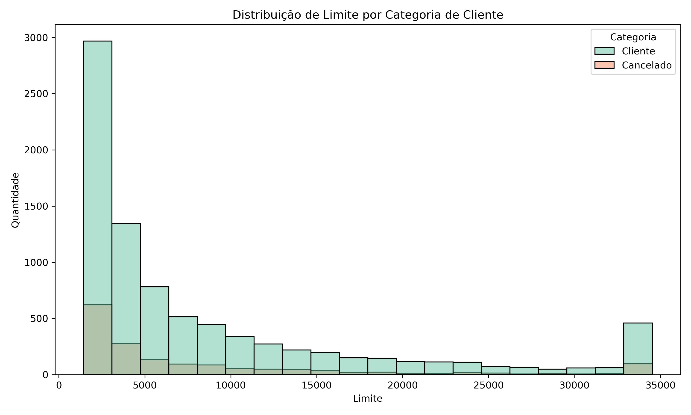

# Análise de Churn de Cartões de Crédito: Prevenindo o Cancelamento de Clientes

## Contexto do Projeto

Este projeto foi desenvolvido como parte do minicurso de Análise de Dados com Python da Hashtag Programação. O objetivo principal foi analisar uma base de dados de clientes de um grande banco emissor de cartões de crédito para identificar os principais fatores que levam ao cancelamento de contas (**churn**). Compreender esses fatores é crucial para a empresa, pois o aumento significativo no número de cancelamentos está gerando prejuízos consideráveis.

---

## Análise Exploratória e Conclusões

A análise exploratória dos dados envolveu a visualização da distribuição de diversas variáveis em relação à categoria do cliente (ativo ou cancelado). Abaixo, apresento os insights mais relevantes obtidos a partir dos gráficos analisados:

### 1. Distribuição da Categoria do Cartão

**Conclusão:** Observamos que a grande maioria dos clientes que cancelaram seus cartões pertencia à categoria **Blue**. Isso sugere fortemente que essa categoria de cartão pode não estar oferecendo benefícios ou condições satisfatórias para os clientes, levando-os a buscar alternativas em outras instituições financeiras. É possível que taxas não competitivas, falta de vantagens ou serviços percebidos como insuficientes para essa categoria estejam contribuindo para o churn.

---

### 2. Distribuição de Meses como Cliente

**Conclusão:** Uma parcela significativa dos cancelamentos ocorreu nos **primeiros 35 meses** de relacionamento com o banco. Isso levanta a hipótese de que os clientes podem ter expectativas iniciais (como benefícios ou condições especiais por serem novos clientes) que não foram atendidas ao longo do tempo. Outra possibilidade é que, após esse período inicial, os clientes passem a receber ofertas mais atrativas de outros bancos, levando à migração. Estratégias de retenção focadas nos primeiros anos de relacionamento parecem ser cruciais.

---

### 3. Distribuição de Inatividade nos Últimos 12 Meses

**Conclusão:** A maioria dos clientes que cancelaram suas contas apresentava um período de **inatividade entre 26 e 36 meses**. Isso indica que a falta de uso do cartão e dos serviços bancários é um forte precursor do cancelamento. O banco poderia ter identificado esses clientes inativos precocemente e implementado ações de reativação, como ofertas personalizadas ou a comunicação de novos benefícios, para tentar reengajá-los e evitar o churn.

---

### 4. Distribuição de Número de Contatos nos Últimos 12 Meses

**Conclusão:** Observamos que clientes que foram contatados pelo banco **2, 3 ou 4 vezes nos últimos 12 meses** apresentaram uma maior taxa de cancelamento. Isso sugere que um número elevado de contatos (possivelmente para cobranças, ofertas não solicitadas ou tentativas de resolução de problemas) pode ser percebido como incômodo ou ineficaz pelos clientes, contribuindo para a decisão de cancelar a conta. É importante avaliar a natureza e a frequência desses contatos para garantir que a comunicação seja relevante e não intrusiva.

---

### 5. Distribuição de Limite do Cartão

**Conclusão:** Quase todos os clientes que cancelaram seus cartões possuíam um **limite abaixo de R\$5.000**. Paralelamente, a quantidade de clientes ativos com limites superiores a esse valor diminui significativamente. Essa correlação forte sugere que a dificuldade em obter aumentos de limite ou a percepção de um limite inadequado para suas necessidades pode ser um fator crucial de insatisfação e, consequentemente, de cancelamento. A política de concessão e aumento de limites precisa ser cuidadosamente revisada.

---

### 6. Distribuição de Limite Consumido e Taxa de Utilização do Cartão

**Conclusão:** Notamos que a maioria dos clientes cancelados apresentava um **limite consumido muito baixo (praticamente zero)** e uma **taxa de utilização do cartão de 0.0**. Isso, em conjunto com o período de inatividade, pode indicar que alguns clientes utilizaram o limite inicial concedido e, por diversos motivos (insatisfação com o limite, falta de interesse nos benefícios, etc.), deixaram de usar o cartão e, eventualmente, cancelaram a conta. Em outros casos, pode sugerir que os clientes nem chegaram a utilizar o cartão de forma significativa antes de cancelar.

---

### 7. Relação entre Uso do Cartão e Cancelamento

**Conclusão:** De forma geral, observamos que **quanto maior a frequência de uso do cartão e a interação com os serviços do banco, menor a probabilidade de cancelamento**. Isso reforça a importância de estratégias que incentivem o engajamento contínuo do cliente, como programas de pontos, recompensas por metas de gastos e benefícios que agreguem valor ao relacionamento com o banco.

---

## Conclusão Final

A análise dos dados revela que os principais fatores associados ao cancelamento de cartões de crédito incluem:

* **Insatisfação com a categoria do cartão Blue**, possivelmente devido a falta de benefícios ou condições desfavoráveis.
* **Período inicial de relacionamento sem o atendimento de expectativas ou sem estratégias de retenção eficazes.**
* **Longos períodos de inatividade**, indicando uma desconexão do cliente com os serviços do banco.
* **Número excessivo de contatos**, que podem ser percebidos como intrusivos ou ineficazes.
* **Limites de crédito considerados baixos ou dificuldade em obter aumentos.**
* **Baixo engajamento e utilização do cartão**, sugerindo falta de valor percebido ou alternativas mais atraentes.

Para mitigar o churn, o banco deve considerar as seguintes ações:

* **Revisitar os benefícios e condições da categoria de cartão Blue**, tornando-a mais competitiva e atraente.
* **Implementar programas de retenção focados nos primeiros meses e anos de relacionamento**, oferecendo benefícios ou condições especiais para manter o engajamento.
* **Desenvolver estratégias proativas para identificar e reativar clientes inativos**, através de comunicação personalizada e ofertas relevantes.
* **Otimizar a estratégia de comunicação com os clientes**, garantindo que os contatos sejam relevantes, informativos e não excessivos.
* **Reavaliar a política de concessão e aumento de limites de crédito**, buscando um equilíbrio entre a gestão de risco e a satisfação do cliente.
* **Criar e promover programas de incentivo ao uso do cartão**, como programas de pontos e recompensas por gastos, para aumentar o engajamento e a lealdade.

Ao implementar essas ações com base na análise de dados, a empresa estará melhor equipada para reduzir o churn e construir relacionamentos mais duradouros e lucrativos com seus clientes.